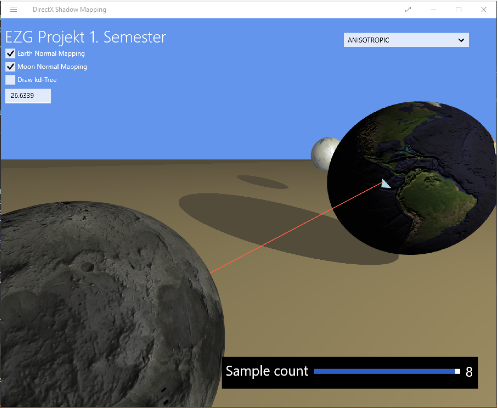
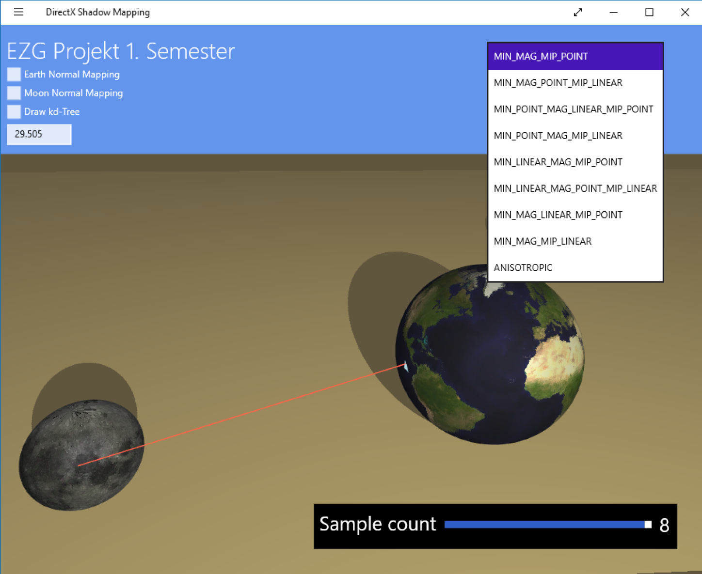
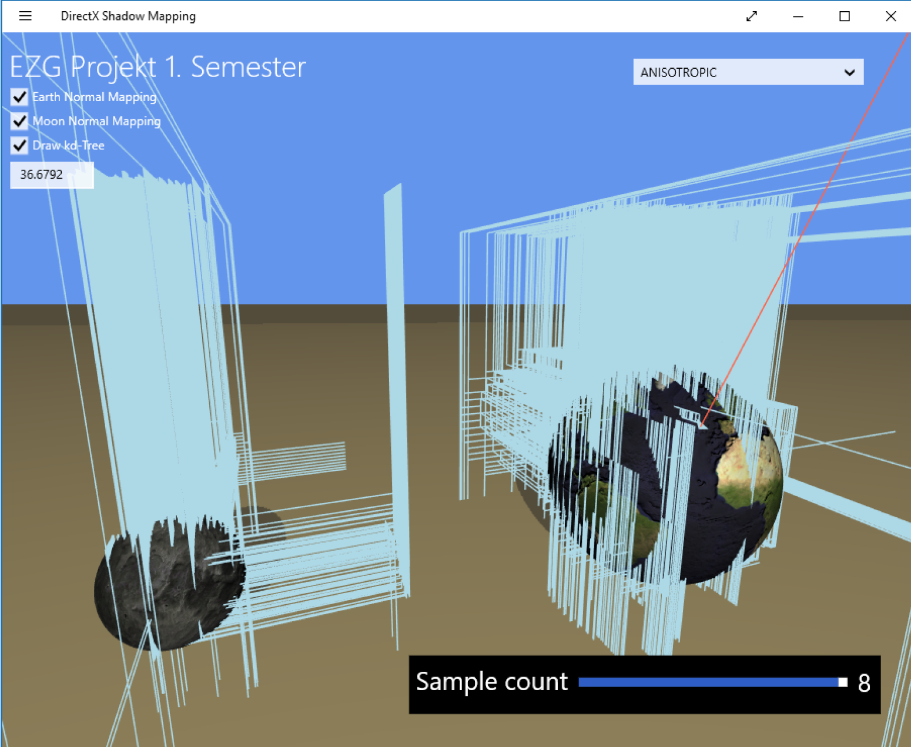

# DirectX-shadow-mapping_kd-tree
DirectX 3D Visualization of a scene with three objects (Windows 8 SDK).

1. 3 objects
2. Kochanek-Bartels Spline Interpolation for an automated tracking shot with 5 points in the scene + Quaternion Squad Interpolation
3. Shadow Mapping with changeable light source
4. Switch between Bump/Normal Mapping
5. Switch between Texture Filtering and MipMapping
6. Switch between Anti-Aliasing Quality Levels/Sample Count
7. Ray-Tracing with kd-Tree and visualization of the hit triangle; Camera-To-Point and Point-To-Point distance measurement

DirectX Scene with Point-To-Point measurement, shadow mapping, anti-aliasing and normal mapping (Textures in Debug/ShadowMapping/AppX):

## Controls

Control    |    Action
-----------|-----------------------------------
[W] / [S]  |  move camera forward / backward
[A] / [D]  |  move camera left / right
["] / [#]  |  camera rotation x-axis
[ ] / [!]  |  camera rotation y-axis
[Q] / [E]  |  camera rotation z-axis
[I] / [K]  |  light source forward / backward
[J] / [L]  |  light source left / right
[Z] / [H]  |  light source rotation x-axis
[U] / [O]  |  light source rotation y-axis
[N] / [M]  |  light source rotation z-axis
[Enter] | camera back to starting point of tracking shot
[F1] | start tracking shot
[1][2][3][4][5] | set new interpolation points for the tracking shot
[Space] | Switch between Camera-To-Point and Point-To-Point Messung
[RMT] | Ray to mouse position

## Anti-Aliasing

## kd-Tree

Performance measurement of 11904 triangles:
* Raycast all triangles [ms]: 00:00:00.029;
* Raycast triangles with kd-tree [ms]: 00:00:00.007;

